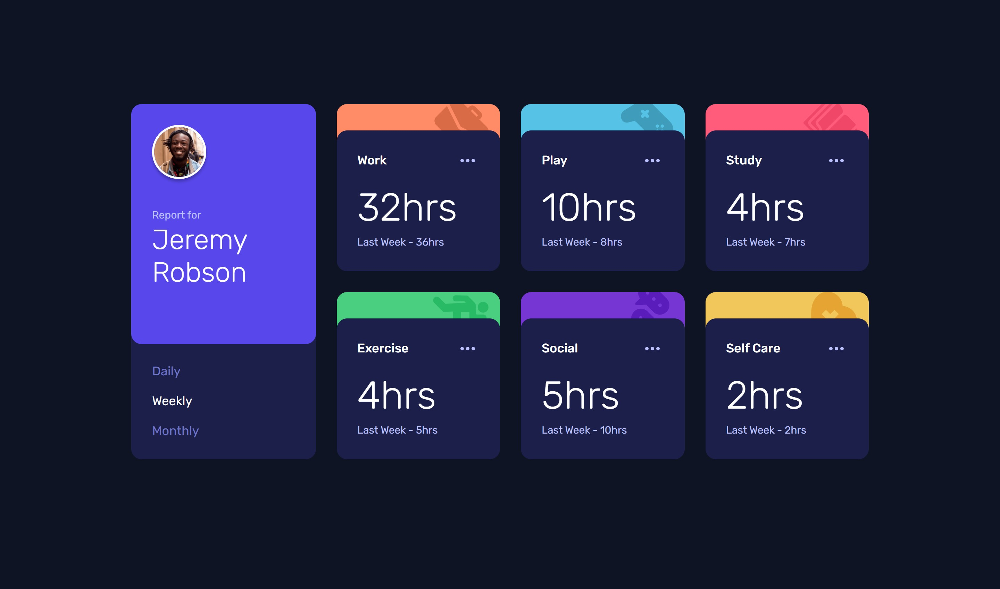

# Frontend Mentor - Time tracking dashboard solution

This is a solution to the [Time tracking dashboard challenge on Frontend Mentor](https://www.frontendmentor.io/challenges/time-tracking-dashboard-UIQ7167Jw).

## Overview

### The challenge

Users should be able to:

- View the optimal layout for the site depending on their device's screen size
- See hover states for all interactive elements on the page
- Switch between viewing Daily, Weekly, and Monthly stats

### Screenshot



## My process

### Built with

- Semantic HTML5 markup
- CSS custom properties
- Flexbox
- CSS Grid
- Mobile-first workflow

### What I learned

```js
try {
  const response = await fetch("./data.json");
  data = await response.json();
  updateDisplay("weekly");
} catch (error) {
  console.error("Error fetching data:", error);
}
```

## Author

- Frontend Mentor - [@MaxCoder-mc](https://www.frontendmentor.io/profile/MaxCoder-mc)
